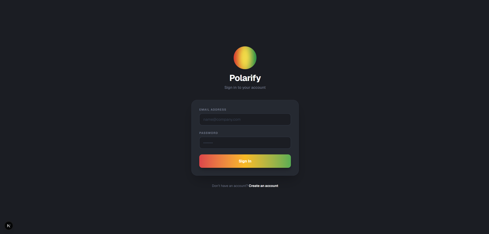
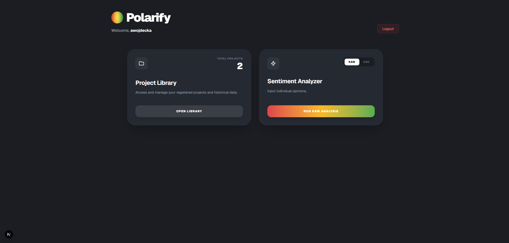
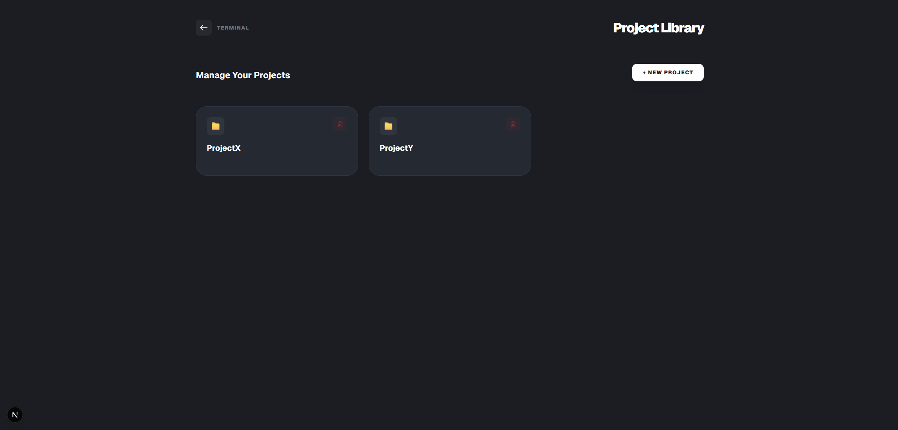
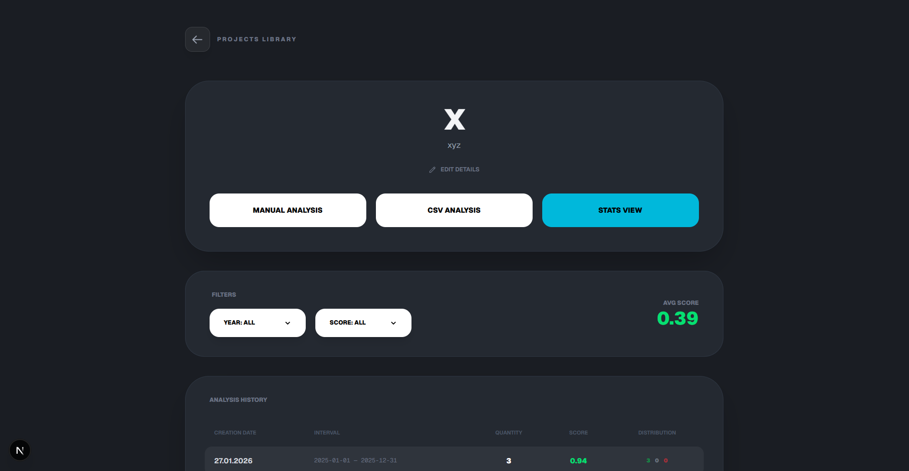
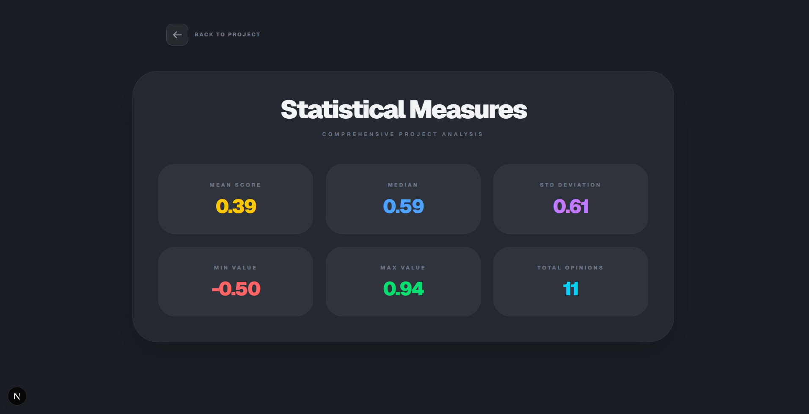
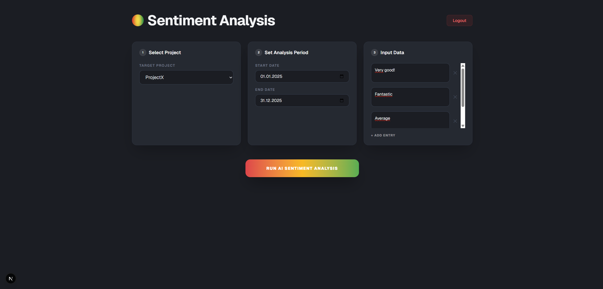
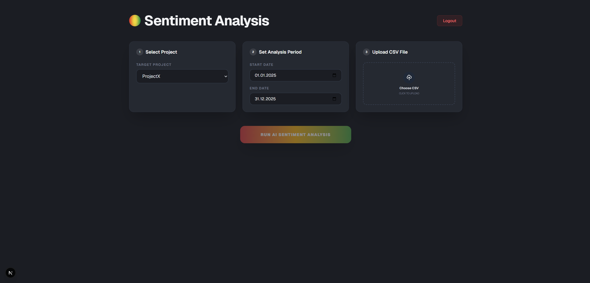
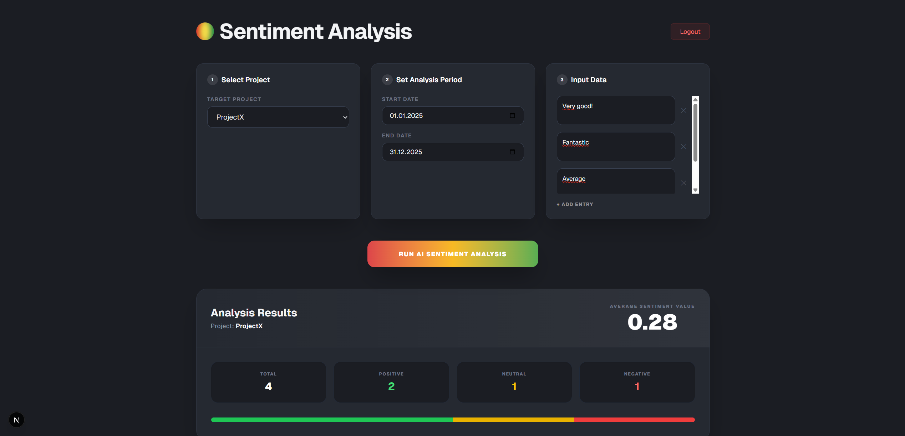

# Polarify Frontend
## Description
This is AI-generated frontend for Polarify API.

## Getting Started

To run the development server:

```bash
npm run dev
```

Open [http://localhost:3000](http://localhost:3000) with your browser to see the result.

## Screens

Homepage


Registration


Login


Dashboard


Project Library


Project Details


Project Details - Statistical Measures


Sentiment Analysis - page where user can perform opinion sentiment analysis based on AI, providing raw opinions manually or uploading csv file.





